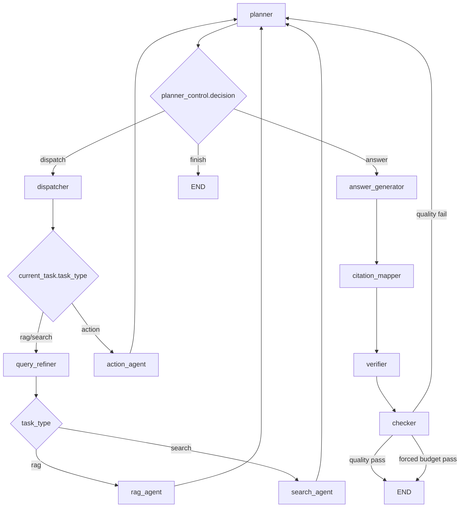
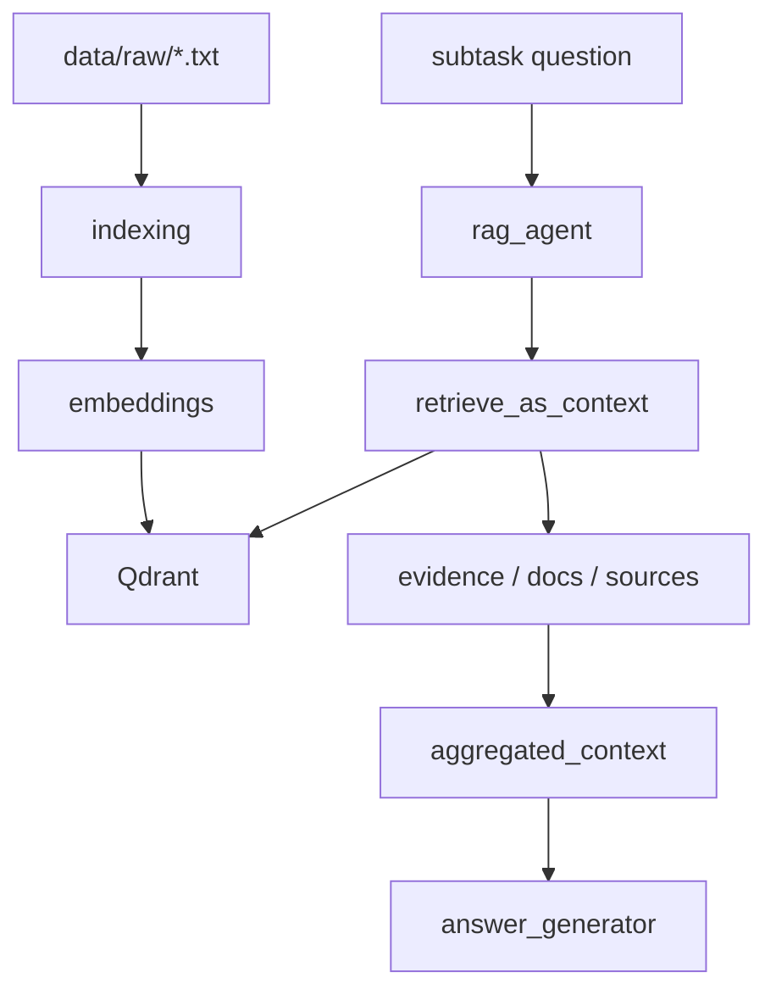

# LangGraph Agent Flow Visualization

本文档描述当前项目中的 supervisor 风格 LangGraph 编排框架，以及它的状态设计、降级策略和当前已知问题。

需要特别说明的是：

- 这张图描述的是当前系统的能力骨架与控制边界
- 它不是对未来所有任务都写死的业务 workflow
- 当前 graph 提供的是可复用节点角色、预算控制、可信回答链路和工具边界
- 更复杂的任务流程应尽量由 agent 在图上规划出来，而不是通过不断硬编码专用分支来实现
- 显式例外是知识库构建、索引刷新这类高副作用或长时任务，它们更适合作为独立工程化子流程

## 1. 总入口

```text
Client
  -> POST /chat
  -> FastAPI route
  -> build initial AgentState
  -> LangGraph agent_graph
  -> return final AgentState
```

对应代码：

- `app/api/routes/chat.py`
- `app/agent/graph.py`

## 2. 当前主流程



这条链路表达的是当前默认回答链路：

```text
用户问题
  -> planner 拆解/选择子任务
  -> dispatcher 分发
  -> query_refiner 做 query 重写和拆分
  -> 子 agent 执行
  -> 回到 planner 复盘
  -> answer_generator 生成答案草稿
  -> citation_mapper 补引用
  -> verifier 做轻量支持度检查
  -> checker 审核
  -> 正常通过则输出
  -> 未通过则回到 planner
  -> 若达到预算限制则强制放行最佳努力答案
```

它适合回答当前大多数“先规划、再检索/搜索、再生成、再验证”的问题，但它不意味着未来所有任务都必须逐节点走完整链路。

未来更合理的演化方向是：

- 简单本地 RAG 问题走更短的 fast path
- 明确要求联网或本地检索不足时，转入 online search path
- 复杂工具执行类问题走 tool/runtime path
- 只有知识库构建、索引维护这类任务，才额外进入独立子流程
- 复杂 retrieval/search 问题逐步引入 LangGraph 支持的并行 fan-out / fan-in

## 3. Graph 的定位

当前 graph 更适合被理解为一张“能力编排图”，而不是一份“固定任务清单”。

它主要负责四件事：

1. 为 agent 提供稳定的规划、检索、执行、生成、验证边界
2. 约束高成本节点的调用顺序和预算
3. 统一 state / evidence / citation 的流转方式
4. 为后续更复杂的 retrieval routing 和 tool runtime 留出扩展接口
5. 为 future fan-out / fan-in 并行分支保留清晰的汇合点

这意味着：

- graph 中的节点角色是相对稳定的
- 但 agent 在节点之间走出的具体 task workflow 可以随着问题类型变化
- 文档里不应把“某个未来任务一定按某个固定链路执行”写死

## 4. 节点职责

### planner

职责：

- 读取主问题、已有子任务、已汇总上下文、checker 反馈
- 生成或更新 `subtasks`
- 决定当前动作：
  - `dispatch`
  - `answer`
  - `finish`
- 选择当前要执行的 `selected_task_id`
- 在达到预算限制时，不再继续派发，转入回答生成

设计意图：

- `planner` 决定“现在应该做什么”
- 但它不应该承载所有检索细节
- 更细的本地层次化路由、在线搜索策略、工具风险分级，后续应逐步下沉到更专门的节点或 runtime 组件

关键输出：

- `thought`
- `subtasks`
- `planner_control`
- `current_task`

### dispatcher

职责：

- 根据 `planner_control.selected_task_id` 选中子任务
- 将任务状态标记为 `running`
- 根据 `task_type` 路由到具体子 agent

当前是串行分发，但接口已经是 task-based，后续可以演进到并行 fan-out / fan-in。

它的定位更偏“任务路由器”，而不是最终的复杂 workflow 引擎。

### query_refiner

职责：

- 对 `rag` / `search` 子任务做 query 重写
- 对复杂问题生成少量 `sub_queries`
- 为下游检索与搜索提供更直观、可执行的查询

当前实现特点：

- 使用单次结构化 LLM 输出
- 优先保持用户原始语种，避免无意义的英文化重写
- 对简单问题尽量不拆，对复杂问题也只保留少量非重叠 `sub_queries`
- 不区分“本地检索”和“在线搜索”的高层策略，只统一做信息型任务的 query 优化

后续演化方向：

- 对本地 RAG，配合层次化知识库元数据做粗到细的范围收缩
- 对本地 RAG，逐步支持多路召回与重排序，而不只是单次向量检索
- 对在线搜索，更多承担实体约束、问题压缩和搜索意图表达
- 对简单问题保持克制，减少无意义 rewrite

### rag_agent

职责：

- 执行本地知识库检索
- 复用 `retrieve_as_context(...)`
- 回写：
  - 子任务 `result`
  - 子任务 `evidence`
  - 子任务 `sources`
  - 全局 `retrieved_docs`
  - 全局 `retrieved_sources`
  - 全局 `evidence`
  - `aggregated_context`

特点：

- 这是当前系统里第一个真实可用的子 agent
- 检索失败时会保守降级为空结果，而不是中断整条链路

当前与未来的差异：

- 当前仍是单层向量检索
- 近期目标是升级为更结构化的本地 retrieval routing：
  - 文件夹/知识域层级
  - Qdrant 中的层次化组织
  - 每层知识域的元数据描述
  - 逐层缩小范围后再进入细粒度 chunk 检索
  - 在选定范围内支持多路召回与重排序

更成熟的目标 pipeline 应更接近：

```text
route to scope
  -> multi-recall
  -> candidate fusion
  -> rerank
  -> chunk selection
  -> evidence
```

### search_agent

职责：

- 处理信息获取类任务
- 优先尝试使用 Tavily 执行真实搜索
- 对少量高质量 URL 做网页抽取
- 对抽取内容做临时 chunk 化和二次筛选
- 若未配置 `TAVILY_API_KEY`，回退到 mock 搜索
- 写回统一 evidence 结构

当前问题：

- 缺少 API key 时仍然是 mock
- 当前网页抽取与 chunk rerank 仍偏轻量，不是更成熟的标准化 search pipeline
- 当前结果清洗与来源筛选仍有启发式成分

后续定位：

- 作为本地 RAG 不足时的补充型 retrieval
- 或作为用户显式要求联网搜索时的主路径
- 不追求对所有问题都默认联网

更成熟的目标 pipeline 应更接近：

```text
query planning
  -> search
  -> result normalization
  -> dedup
  -> extract
  -> chunk
  -> rerank
  -> evidence selection
```

设计原则：

- 尽量少依赖不断堆叠的人工启发式
- 优先把质量提升放在 pipeline 设计、排序质量、去重和结构化 evidence 上

### action_agent

职责：

- 处理执行类任务
- 当前仍为 mock
- 写回模拟执行结果

当前问题：

- 它不是实际外部动作执行
- 同样会标记降级信息

长远定位：

- 这里不会只停留在“单个动作工具”
- 它更适合作为未来 tool runtime 的执行边界
- 后续会逐步承接：
  - 信息获取工具
  - 本地文件工具
  - 代码读写与执行工具
  - 知识库构建工具
  - 其他多步复杂任务的执行单元

### answer_generator

职责：

- 汇总已完成子任务
- 基于 `aggregated_context + evidence + subtasks` 生成 `answer_draft`
- 若 planner 已判定达到预算限制，会在答案前附加限制说明

当前原则：

- 优先生成“有证据约束的回答”
- 不追求在证据不足时强行完整

### citation_mapper

职责：

- 将 `answer_draft` 按段落拆分
- 为每个关键段落映射最相关的 evidence
- 生成 `grounded_answer`
- 生成结构化 `citations`

当前实现特点：

- 使用轻量规则做段落级引用映射
- 不额外调用 LLM
- 优先在对应子任务的 evidence 中找引用，再回退到全局 evidence
- 会对同段重复引用做去重
- 优先控制 token 消耗与响应速度
- 当前策略偏保守，宁可少贴，也不硬贴低相关 chunk

### verifier

职责：

- 检查关键段落是否带引用
- 计算 `citation_coverage`
- 标记 `unsupported_claims`
- 识别是否引用了降级来源
- 输出 `verification_result`

当前实现特点：

- 是轻量校验，不是完整 claim-level fact checking
- 目标是先快速过滤掉明显不可信的回答

它当前承担的是“可信底线”，不是最终的完整事实审查器。

### checker

职责：

- 正常情况下检查答案草稿是否足够回答用户问题
- 输出：
  - `passed`
  - `feedback`
  - `pass_reason`

当前行为分三类：

- `quality_pass`
- `quality_fail`
- `forced_budget_pass`

说明：

- `checker` 的主审核逻辑仍保留
- 但它现在会先消费 `verification_result`
- 当 verifier 判断引用覆盖不足或存在未支持段落时，会直接打回 planner
- 只有在预算限制已触发时，才会直接放行当前最佳努力答案

从长期看，`checker` 更像“回答放行控制器”，而不是唯一真理来源。

## 5. 当前状态结构

`AgentState` 已从单轮动作状态升级为任务编排状态。

核心顶层字段：

- `question`
- `subtasks`
- `planner_control`
- `current_task`
- `aggregated_context`
- `evidence`
- `answer_draft`
- `grounded_answer`
- `citations`
- `verification_result`
- `checker_result`
- `trace_summary`
- `started_at`
- `iteration_count`
- `max_iterations`
- `max_duration_seconds`
- `answer`
- `status`

当前上下文压缩策略：

- `aggregated_context` 优先保留每个已完成子任务的紧凑摘要，而不是原始长结果
- 传给 `answer_generator` 的 evidence 会截断并去重，避免把整份搜索结果原样塞回模型
- 真实搜索结果会做轻量排序与截断，优先保留更可信、更贴题的少量结果

`SubTask` 重点字段：

- `task_id`
- `task_type`
- `question`
- `status`
- `result`
- `evidence`
- `sources`
- `error`
- `degraded`
- `degraded_reason`
- `rewritten_query`
- `sub_queries`
- `rewrite_reason`

`PlannerControl` 重点字段：

- `decision`
- `selected_task_id`
- `planner_note`
- `checker_feedback`
- `force_answer_reason`

`CheckerResult` 重点字段：

- `passed`
- `feedback`
- `pass_reason`

`VerificationResult` 重点字段：

- `needs_revision`
- `citation_coverage`
- `confidence`
- `unsupported_claims`
- `degraded_citations`
- `summary`

## 6. 当前降级策略

当前系统采用“预算驱动的最佳努力回答”。

预算维度：

- 思考轮数限制：`max_iterations`
- 思考时间限制：`max_duration_seconds`

触发方式：

- planner 每轮都会检查预算
- 一旦触发，planner 会改为进入 `answer_generator`
- `answer_generator` 会把限制原因写进答案草稿
- `citation_mapper` 与 `verifier` 仍会运行
- `checker` 看到这是强制回答后，会以 `forced_budget_pass` 放行

这套策略解决的问题：

- 防无限回环
- 防过量 LLM 调用
- 在 search/action 仍为 mock 时，避免系统为了“拿不到的真实信息”反复空转
- 即使进入最佳努力回答，也尽量保留引用与支持度信息

这套策略的代价：

- 它偏向“可控结束”，而不是“尽力搜索到最后一刻”
- 预算限制目前是 workflow 级，而不是节点级

## 7. RAG 与子 agent 的关系

当前保留了已有的 RAG 能力，`rag_agent` 直接复用检索封装：

```text
rag_agent
  -> retrieve_as_context(query)
     -> embed_query(query)
     -> QdrantStore.search(...)
     -> items_to_docs(...)
     -> items_to_sources(...)
     -> items_to_evidence(...)
  -> write result back to subtask and AgentState
```

对应数据链路：



## 8. 当前系统做法与问题拆解

### 现行做法

- 使用 planner 驱动 subtasks
- 通过 dispatcher 做 task-based 串行分发
- 将真实能力先落在 RAG
- 将 search 接成真实 Tavily + 轻量网页抽取能力
- 将 action 暂时保留为 mock 边界
- 用 answer_generator + checker 分离生成与验证
- 用预算限制兜底回环

这套做法的核心价值在于：

- 先把“能力边界”和“可信链路”搭起来
- 再逐步替换内部实现
- 而不是先写死大量专用 workflow 再事后清理

### 当前问题

- `search_agent` 已接入真实搜索，但结果标准化、抽取、chunk 化、重排与证据选择仍是第一版实现
- `query_refiner` 目前只做轻量 query 重写与拆分，还没有更复杂的 local routing / online search policy
- `action_agent` 不是真实执行器
- `citation_mapper` 目前是段落级引用映射，不是句级引用
- `verifier` 目前是轻量检查，不是完整事实核验器
- `aggregated_context`、全局 `evidence` 与 `subtasks[*].result/evidence` 之间仍有信息重复
- 预算限制目前是全局的，缺少更细的节点级超时治理
- `checker` 的失败类型还不够细
- 并行调度接口已预留，但尚未实现 retrieval/search 级 fan-out / fan-in
- 本地 RAG 还没有层次化知识域、路由元数据、多路召回和逐层缩小范围的 retrieval subgraph
- 简单任务还没有稳定 fast path，复杂任务也还没有独立 tool runtime

### 为什么这样做仍然合理

- 当前阶段的重点是验证编排框架，而不是一次性把所有工具接全
- 真实 RAG + mock 其余能力，是一种成本更低、但依然能验证控制流和状态流转的折中方案
- 保留较胖的 state，也有利于调试 planner / checker / fallback 的行为
- 先强调能力边界而不是写死任务流程，更符合后续向复杂 agent 助手演化的方向

## 9. 代码映射

- `app/api/routes/chat.py`
  - `/chat` 入口
  - 初始化新版本 `AgentState`

- `app/core/config.py`
  - 读取 `AGENT_MAX_ITERATIONS`
  - 读取 `AGENT_MAX_DURATION_SECONDS`

- `app/agent/state.py`
  - 定义 `AgentState`
  - 定义 `SubTask`
  - 定义 `PlannerControl`
  - 定义 `CheckerResult`

- `app/agent/schemas.py`
  - 定义 `TaskItem`
  - 定义 `PlannerDecision`
  - 定义 `CheckerDecision`

- `app/agent/graph.py`
  - 定义 supervisor 风格 LangGraph
  - 负责 planner、dispatcher、各子 agent、citation_mapper、verifier、checker 的基础路由骨架

- `app/agent/nodes.py`
  - 实现 planner / dispatcher / rag_agent / search_agent / action_agent / answer_generator / citation_mapper / verifier / checker

- `app/rag/retriever.py`
  - 保留现有知识库检索能力
  - 是后续分层 local retrieval 的现有起点

## 10. 对后续演化的约束

后续无论新增多少能力，建议继续遵守下面几条原则：

- 不把 graph 文档写成硬编码任务清单
- 优先描述稳定节点角色、state 契约和能力边界
- 把知识库构建、索引刷新这类高副作用流程单独工程化
- 把一般复杂问题的执行路径交给 agent 规划，而不是预先写死所有专用 workflow
- 让 retrieval、tool use、citation、verification 使用尽量统一的数据契约
- 尽量减少把系统主干建立在手工启发式上的做法
- 优先用成熟 pipeline、多路召回、重排序和 fan-out / fan-in 图结构解决复杂问题

## 11. 下一步建议

- 先把本地 RAG 做成更结构化、支持多路召回与重排序的层次化检索系统
- 再把在线搜索收敛为补充型 retrieval，并向更成熟的 search pipeline 演化
- 同时逐步把复杂 retrieval/search 任务升级为支持并行 fan-out / fan-in 的图结构
- 之后再把 `action_agent` 演化为更完整的 tool runtime 与复杂任务执行边界
