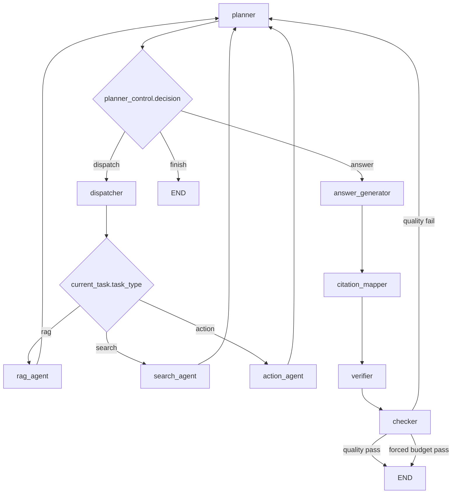
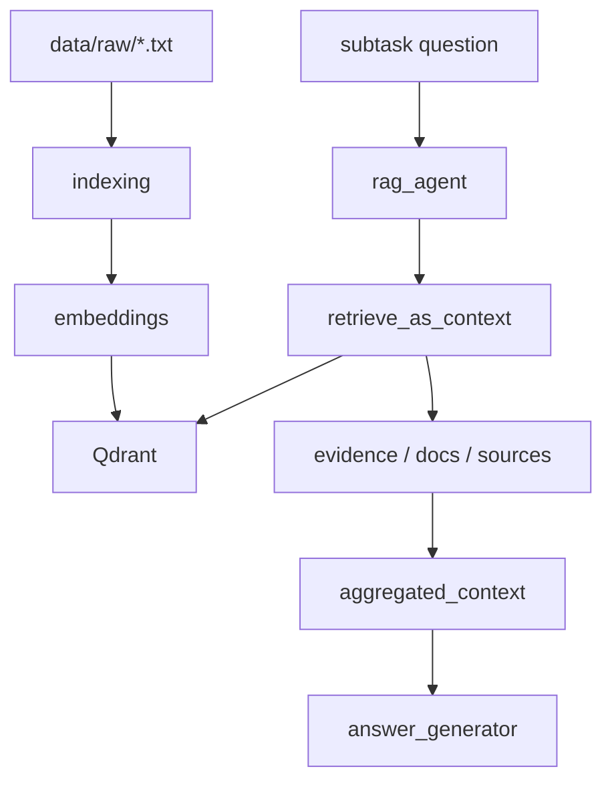

# LangGraph Agent Flow Visualization

本文档描述当前项目中的 supervisor 风格 LangGraph 编排框架，以及它的状态设计、降级策略和当前已知问题。

## 1. 总入口

```text
Client
  -> POST /chat
  -> FastAPI route
  -> build initial AgentState
  -> LangGraph agent_graph
  -> return final AgentState
```

对应代码：

- `app/api/routes/chat.py`
- `app/agent/graph.py`

## 2. 当前主流程



这条链路表达的是：

```text
用户问题
  -> planner 拆解/选择子任务
  -> dispatcher 分发
  -> 子 agent 执行
  -> 回到 planner 复盘
  -> answer_generator 生成答案草稿
  -> citation_mapper 补引用
  -> verifier 做轻量支持度检查
  -> checker 审核
  -> 正常通过则输出
  -> 未通过则回到 planner
  -> 若达到预算限制则强制放行最佳努力答案
```

## 3. 节点职责

### planner

职责：

- 读取主问题、已有子任务、已汇总上下文、checker 反馈
- 生成或更新 `subtasks`
- 决定当前动作：
  - `dispatch`
  - `answer`
  - `finish`
- 选择当前要执行的 `selected_task_id`
- 在达到预算限制时，不再继续派发，转入回答生成

关键输出：

- `thought`
- `subtasks`
- `planner_control`
- `current_task`

### dispatcher

职责：

- 根据 `planner_control.selected_task_id` 选中子任务
- 将任务状态标记为 `running`
- 根据 `task_type` 路由到具体子 agent

当前是串行分发，但接口已经是 task-based，后续可以演进到并行 fan-out。

### rag_agent

职责：

- 执行本地知识库检索
- 复用 `retrieve_as_context(...)`
- 回写：
  - 子任务 `result`
  - 子任务 `evidence`
  - 子任务 `sources`
  - 全局 `retrieved_docs`
  - 全局 `retrieved_sources`
  - 全局 `evidence`
  - `aggregated_context`

特点：

- 这是当前系统里第一个真实可用的子 agent
- 检索失败时会保守降级为空结果，而不是中断整条链路

### search_agent

职责：

- 处理信息获取类任务
- 当前仍为 mock
- 写回“看似合理”的搜索摘要，供 planner / answer_generator / checker 验证编排链路

当前问题：

- 它不是实时联网搜索
- 因此结果带有 `degraded=True` 与 `degraded_reason`

### action_agent

职责：

- 处理执行类任务
- 当前仍为 mock
- 写回模拟执行结果

当前问题：

- 它不是实际外部动作执行
- 同样会标记降级信息

### answer_generator

职责：

- 汇总已完成子任务
- 基于 `aggregated_context + evidence + subtasks` 生成 `answer_draft`
- 若 planner 已判定达到预算限制，会在答案前附加限制说明

### citation_mapper

职责：

- 将 `answer_draft` 按段落拆分
- 为每个关键段落映射最相关的 evidence
- 生成 `grounded_answer`
- 生成结构化 `citations`

当前实现特点：

- 使用轻量规则做段落级引用映射
- 不额外调用 LLM
- 优先控制 token 消耗与响应速度

### verifier

职责：

- 检查关键段落是否带引用
- 计算 `citation_coverage`
- 标记 `unsupported_claims`
- 识别是否引用了降级来源
- 输出 `verification_result`

当前实现特点：

- 是轻量启发式校验，不是完整 claim-level fact checking
- 目标是先快速过滤掉明显不可信的回答

### checker

职责：

- 正常情况下检查答案草稿是否足够回答用户问题
- 输出：
  - `passed`
  - `feedback`
  - `pass_reason`

当前行为分三类：

- `quality_pass`
- `quality_fail`
- `forced_budget_pass`

说明：

- `checker` 的主审核逻辑仍保留
- 但它现在会先消费 `verification_result`
- 当 verifier 判断引用覆盖不足或存在未支持段落时，会直接打回 planner
- 只有在预算限制已触发时，才会直接放行当前最佳努力答案

## 4. 当前状态结构

`AgentState` 已从单轮动作状态升级为任务编排状态。

核心顶层字段：

- `question`
- `subtasks`
- `planner_control`
- `current_task`
- `aggregated_context`
- `evidence`
- `answer_draft`
- `grounded_answer`
- `citations`
- `verification_result`
- `checker_result`
- `trace_summary`
- `started_at`
- `iteration_count`
- `max_iterations`
- `max_duration_seconds`
- `answer`
- `status`

`SubTask` 重点字段：

- `task_id`
- `task_type`
- `question`
- `status`
- `result`
- `evidence`
- `sources`
- `error`
- `degraded`
- `degraded_reason`

`PlannerControl` 重点字段：

- `decision`
- `selected_task_id`
- `planner_note`
- `checker_feedback`
- `force_answer_reason`

`CheckerResult` 重点字段：

- `passed`
- `feedback`
- `pass_reason`

`VerificationResult` 重点字段：

- `needs_revision`
- `citation_coverage`
- `confidence`
- `unsupported_claims`
- `degraded_citations`
- `summary`

## 5. 当前降级策略

当前系统采用“预算驱动的最佳努力回答”。

预算维度：

- 思考轮数限制：`max_iterations`
- 思考时间限制：`max_duration_seconds`

触发方式：

- 只有当 planner 想继续 `dispatch` 时，预算限制才会真正截断探索
- 一旦触发，planner 会改为进入 `answer_generator`
- `answer_generator` 会把限制原因写进答案草稿
- `citation_mapper` 与 `verifier` 仍会运行
- `checker` 看到这是强制回答后，会以 `forced_budget_pass` 放行

这套策略解决的问题：

- 防无限回环
- 防过量 LLM 调用
- 在 search/action 仍为 mock 时，避免系统为了“拿不到的真实信息”反复空转
- 即使进入最佳努力回答，也尽量保留引用与支持度信息

这套策略的代价：

- 它偏向“可控结束”，而不是“尽力搜索到最后一刻”
- 预算限制目前是 workflow 级，而不是节点级

## 6. RAG 与子 agent 的关系

当前保留了已有的 RAG 能力，`rag_agent` 直接复用检索封装：

```text
rag_agent
  -> retrieve_as_context(query)
     -> embed_query(query)
     -> QdrantStore.search(...)
     -> items_to_docs(...)
     -> items_to_sources(...)
     -> items_to_evidence(...)
  -> write result back to subtask and AgentState
```

对应数据链路：



## 7. 当前系统做法与问题拆解

### 现行做法

- 使用 planner 驱动 subtasks
- 通过 dispatcher 做 task-based 串行分发
- 将真实能力先落在 RAG
- 将 search / action 先保留为 mock 边界
- 用 answer_generator + checker 分离生成与验证
- 用预算限制兜底回环

### 当前问题

- `search_agent` 不是真实外网搜索
- `action_agent` 不是真实执行器
- `citation_mapper` 目前是段落级引用映射，不是句级引用
- `verifier` 目前是轻量启发式检查，不是完整事实核验器
- `aggregated_context`、全局 `evidence` 与 `subtasks[*].result/evidence` 之间仍有信息重复
- 预算限制目前是全局的，缺少更细的节点级超时治理
- `checker` 的失败类型还不够细
- 并行调度接口已预留，但尚未实现

### 为什么这样做仍然合理

- 当前阶段的重点是验证编排框架，而不是一次性把所有工具接全
- 真实 RAG + mock 其余能力，是一种成本更低、但依然能验证控制流和状态流转的折中方案
- 保留较胖的 state，也有利于调试 planner / checker / fallback 的行为

## 8. 代码映射

- `app/api/routes/chat.py`
  - `/chat` 入口
  - 初始化新版本 `AgentState`

- `app/core/config.py`
  - 读取 `AGENT_MAX_ITERATIONS`
  - 读取 `AGENT_MAX_DURATION_SECONDS`

- `app/agent/state.py`
  - 定义 `AgentState`
  - 定义 `SubTask`
  - 定义 `PlannerControl`
  - 定义 `CheckerResult`

- `app/agent/schemas.py`
  - 定义 `TaskItem`
  - 定义 `PlannerDecision`
  - 定义 `CheckerDecision`

- `app/agent/graph.py`
  - 定义 supervisor 风格 LangGraph
  - 负责 planner、dispatcher、各子 agent、citation_mapper、verifier、checker 的路由

- `app/agent/nodes.py`
  - 实现 planner / dispatcher / rag_agent / search_agent / action_agent / answer_generator / citation_mapper / verifier / checker

- `app/rag/retriever.py`
  - 保留现有知识库检索能力

## 9. 下一步建议

- 给 `search_agent` 接入真实搜索引擎
- 给 `action_agent` 接入真实工具注册与执行框架
- 让 `checker` 输出更细的失败类型
- 把部分全局派生字段逐步收敛到 `subtasks`
- 后续再把 dispatcher 升级为 fan-out / fan-in 并行分发
